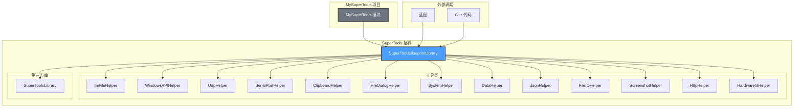

# SuperTools

**[English](README_EN.md) | [中文](README.md)**

基于 Unreal Engine 5.7 的综合工具框架插件，为沉浸式内容和交互开发提供常用功能函数。

**作者**: lostpanda

---

## 目录

- [概述](#概述)
- [架构](#架构)
- [功能特性](#功能特性)
  - [INI 文件操作](#ini-文件操作)
  - [Windows API 封装](#windows-api-封装)
  - [UDP 通信](#udp-通信)
  - [串口通信](#串口通信)
  - [剪贴板操作](#剪贴板操作)
  - [文件对话框](#文件对话框)
  - [系统操作](#系统操作)
  - [数据处理](#数据处理)
  - [JSON 操作](#json-操作)
  - [文件 I/O 操作](#文件-io-操作)
  - [截图操作](#截图操作)
  - [HTTP 操作](#http-操作)
  - [硬件ID](#硬件id)
- [项目结构](#项目结构)
- [环境要求](#环境要求)
- [安装](#安装)
- [使用方法](#使用方法)
- [构建命令](#构建命令)
- [许可证](#许可证)

---

## 概述

SuperTools 是一个功能强大的工具插件，旨在简化 Unreal Engine 5.7 中常见的沉浸式内容和交互开发任务。它提供了一套全面的蓝图可调用函数，涵盖文件操作、网络通信、系统工具等。

**主要优势：**

- 所有函数都支持蓝图调用，接口直观易用
- 适用情况下支持跨平台
- 易于扩展和自定义
- API 文档完善，支持中文关键词搜索

---

## 架构



**架构概览：**

| 层级 | 组件 | 描述 |
|------|------|------|
| **API 层** | `USuperToolsBlueprintLibrary` | 主入口，向蓝图和 C++ 暴露所有函数 |
| **工具层** | `Utils/*Helper` | 模块化的工具类，实现具体功能 |
| **集成层** | `ThirdParty/SuperToolsLibrary` | 外部库支持，运行时 DLL 加载 |
| **调用层** | 蓝图 / C++ | 使用插件函数的游戏代码 |

---

## 功能特性

### INI 文件操作

从 INI 文件读写配置值，支持跨平台。

**蓝图分类：** `SuperTools|INI`

| 函数 | 描述 | 参数 |
|------|------|------|
| `ReadIniString` | 从 INI 文件读取字符串 | `FilePath`, `Section`, `Key`, `DefaultValue` |
| `ReadIniInt` | 从 INI 文件读取整数 | `FilePath`, `Section`, `Key`, `DefaultValue` |
| `ReadIniFloat` | 从 INI 文件读取浮点数 | `FilePath`, `Section`, `Key`, `DefaultValue` |
| `ReadIniBool` | 从 INI 文件读取布尔值 | `FilePath`, `Section`, `Key`, `DefaultValue` |
| `WriteIniString` | 向 INI 文件写入字符串 | `FilePath`, `Section`, `Key`, `Value` |
| `WriteIniInt` | 向 INI 文件写入整数 | `FilePath`, `Section`, `Key`, `Value` |
| `WriteIniFloat` | 向 INI 文件写入浮点数 | `FilePath`, `Section`, `Key`, `Value` |
| `WriteIniBool` | 向 INI 文件写入布尔值 | `FilePath`, `Section`, `Key`, `Value` |

> **注意：** Windows 使用原生 API（`GetPrivateProfileString`/`WritePrivateProfileString`），其他平台使用手动解析。

---

### Windows API 封装

控制应用程序窗口属性和系统设置。

**蓝图分类：** `SuperTools|Windows`

| 函数 | 描述 | 返回类型 |
|------|------|----------|
| `SetWindowTitle` | 设置应用程序窗口标题 | `bool` |
| `GetWindowTitle` | 获取当前窗口标题 | `FString` |
| `GetScreenResolution` | 获取屏幕宽度和高度 | `bool`（输出：Width, Height） |
| `SetWindowPosition` | 设置窗口位置（X, Y） | `bool` |
| `SetWindowSize` | 设置窗口尺寸（Width, Height） | `bool` |
| `MaximizeWindow` | 最大化应用程序窗口 | `bool` |
| `MinimizeWindow` | 最小化应用程序窗口 | `bool` |
| `RestoreWindow` | 从最小化/最大化状态恢复窗口 | `bool` |
| `BringWindowToFront` | 将窗口置于前台 | `bool` |

> **平台说明：** 这些函数仅在 Windows 上有效。其他平台返回 `false` 或空值。

---

### UDP 通信

通过 UDP 协议发送和接收数据，用于网络通信。

**蓝图分类：** `SuperTools|UDP`

#### 发送函数

| 函数 | 描述 | 参数 |
|------|------|------|
| `UdpSendBytes` | 向 IP:Port 发送字节数组 | `IP`, `Port`, `Data` |
| `UdpSendString` | 向 IP:Port 发送字符串消息 | `IP`, `Port`, `Message` |

#### 简化接收接口（推荐）

| 函数 | 描述 | 参数 |
|------|------|------|
| `StartUdpReceive` | 开始监听端口，返回句柄 | `Port` |
| `GetUdpMessage` | 获取最新消息（自动清空缓冲区） | `Handle` → `OutMessage`, `OutSenderIP`, `OutSenderPort` |
| `GetAllUdpMessages` | 获取所有消息（字符串数组） | `Handle` |
| `StopUdpReceive` | 停止监听并释放资源 | `Handle` |

#### 高级接收接口

| 函数 | 描述 | 参数 |
|------|------|------|
| `CreateUdpListener` | 创建自定义缓冲区大小的监听器 | `Port`, `MaxBufferSize` |
| `DestroyUdpListener` | 销毁监听器并释放资源 | `Handle` |
| `IsUdpListenerValid` | 检查监听器句柄是否有效 | `Handle` |
| `HasUdpData` | 检查是否有数据可用 | `Handle` |
| `GetUdpPacketCount` | 获取已接收的数据包数量 | `Handle` |
| `GetAllUdpPackets` | 获取所有数据包（含发送方信息） | `Handle` |
| `GetLatestUdpPacket` | 获取最新的数据包 | `Handle` → `OutPacket` |
| `ClearUdpBuffer` | 清空接收缓冲区 | `Handle` |
| `BytesToString` | 将字节数组转换为 UTF-8 字符串 | `Data` |

---

### 串口通信

完整的串口通信功能，用于硬件集成。

**蓝图分类：** `SuperTools|SerialPort`

| 函数 | 描述 | 参数 |
|------|------|------|
| `OpenSerialPort` | 使用默认设置打开端口 | `PortName`, `BaudRate`（默认：9600） |
| `OpenSerialPortWithConfig` | 使用完整配置打开端口 | `PortName`, `Config`（结构体） |
| `CloseSerialPort` | 关闭串口 | `Handle` |
| `IsSerialPortOpen` | 检查端口是否打开 | `Handle` |
| `SerialWriteBytes` | 向端口写入字节数组 | `Handle`, `Data` |
| `SerialWriteString` | 向端口写入字符串 | `Handle`, `Message` |
| `SerialReadBytes` | 从端口读取字节 | `Handle`, `MaxBytes` |
| `SerialReadString` | 从端口读取字符串 | `Handle`, `MaxBytes` |
| `GetSerialBytesAvailable` | 获取缓冲区中可用字节数 | `Handle` |
| `FlushSerialBuffers` | 清空输入/输出缓冲区 | `Handle`, `bClearInput`, `bClearOutput` |
| `GetAvailableSerialPorts` | 列出所有可用的 COM 端口 | - |

**串口配置（FSerialPortConfig）：**

- `BaudRate`：通信速率（9600、115200 等）
- `DataBits`：每字节数据位（7、8）
- `Parity`：奇偶校验（None、Odd、Even）
- `StopBits`：停止位（1、1.5、2）
- `FlowControl`：流控制（None、Hardware、Software）

> **平台说明：** 串口功能仅在 Windows 平台完整支持。

---

### 剪贴板操作

复制和粘贴文本及图像到系统剪贴板。

**蓝图分类：** `SuperTools|Clipboard`

#### 文本操作

| 函数 | 描述 | 参数 |
|------|------|------|
| `CopyToClipboard` | 复制文本到剪贴板 | `Text` |
| `GetFromClipboard` | 从剪贴板获取文本 | → `OutText` |
| `HasClipboardText` | 检查剪贴板是否有文本 | - |
| `ClearClipboard` | 清空剪贴板内容 | - |

#### 图像操作（仅 Windows）

| 函数 | 描述 | 参数 |
|------|------|------|
| `CopyImageToClipboard` | 复制图像文件到剪贴板 | `ImagePath`（PNG、BMP、JPG） |
| `GetImageFromClipboard` | 保存剪贴板图像到文件 | `SavePath` |
| `HasClipboardImage` | 检查剪贴板是否有图像 | - |

---

### 文件对话框

原生文件和文件夹选择对话框。

**蓝图分类：** `SuperTools|FileDialog`

| 函数 | 描述 | 参数 |
|------|------|------|
| `OpenFileDialog` | 单文件选择 | `DialogTitle`, `DefaultPath`, `FileTypes` → `OutFilePath` |
| `OpenFileDialogMultiple` | 多文件选择 | `DialogTitle`, `DefaultPath`, `FileTypes` → `OutFilePaths` |
| `SaveFileDialog` | 保存文件对话框 | `DialogTitle`, `DefaultPath`, `DefaultFileName`, `FileTypes` → `OutFilePath` |
| `OpenFolderDialog` | 文件夹选择 | `DialogTitle`, `DefaultPath` → `OutFolderPath` |

**文件类型格式示例：**

```text
All Files (*.*)|*.*|Text Files (*.txt)|*.txt|Images (*.png;*.jpg)|*.png;*.jpg
```

---

### 系统操作

系统工具和外部应用程序控制。

**蓝图分类：** `SuperTools|System`

| 函数 | 描述 | 参数 |
|------|------|------|
| `OpenURL` | 在默认浏览器中打开 URL | `URL` |
| `OpenFolderInExplorer` | 在文件资源管理器中打开文件夹 | `FolderPath` |
| `OpenFileWithDefaultApp` | 使用默认应用程序打开文件 | `FilePath` |
| `LaunchApplication` | 启动外部应用程序 | `ExecutablePath`, `Arguments`, `bHidden` |
| `GetEnvVariable` | 获取环境变量值 | `VariableName` |
| `GetFormattedTime` | 获取格式化的当前时间 | `Format`（默认：`%Y-%m-%d %H:%M:%S`） |
| `GetComputerName` | 获取计算机名/主机名 | - |
| `GetCurrentUserName` | 获取当前用户名 | - |

**时间格式说明符：**

- `%Y` - 年份（4 位数字）
- `%m` - 月份（01-12）
- `%d` - 日期（01-31）
- `%H` - 小时（00-23）
- `%M` - 分钟（00-59）
- `%S` - 秒（00-59）

---

### 数据处理

编码、哈希和数据转换工具。

**蓝图分类：** `SuperTools|Data`

#### Base64 编码

| 函数 | 描述 | 参数 |
|------|------|------|
| `Base64Encode` | 将字符串编码为 Base64 | `Input` |
| `Base64Decode` | 解码 Base64 字符串 | `Input` → `OutDecoded` |

#### 哈希函数

| 函数 | 描述 | 参数 |
|------|------|------|
| `MD5Hash` | 计算字符串的 MD5 哈希值 | `Input` → 32 字符十六进制字符串 |
| `MD5HashFile` | 计算文件的 MD5 哈希值 | `FilePath` → `OutHash` |
| `SHA256Hash` | 计算字符串的 SHA256 哈希值 | `Input` → 64 字符十六进制字符串 |
| `SHA256HashFile` | 计算文件的 SHA256 哈希值 | `FilePath` → `OutHash` |

> **注意：** Windows 上的 SHA256 使用 CryptoAPI 以获得最佳性能。

---

### JSON 操作

解析和创建 JSON 数据，支持嵌套路径。

**蓝图分类：** `SuperTools|JSON`

#### 读取值

| 函数 | 描述 | 参数 |
|------|------|------|
| `JsonGetString` | 从 JSON 获取字符串值 | `JsonString`, `FieldName`, `DefaultValue` |
| `JsonGetInt` | 从 JSON 获取整数值 | `JsonString`, `FieldName`, `DefaultValue` |
| `JsonGetFloat` | 从 JSON 获取浮点值 | `JsonString`, `FieldName`, `DefaultValue` |
| `JsonGetBool` | 从 JSON 获取布尔值 | `JsonString`, `FieldName`, `DefaultValue` |
| `JsonGetStringArray` | 从 JSON 获取字符串数组 | `JsonString`, `FieldName` → `OutArray` |

**嵌套路径支持：**

```cpp
// 使用点号访问嵌套值
JsonGetString(JsonStr, "data.user.name", "Unknown")
JsonGetInt(JsonStr, "response.items.0.id", 0)
```

#### 创建 JSON

| 函数 | 描述 | 参数 |
|------|------|------|
| `MakeJsonString` | 创建简单的键值对 JSON | `Key`, `Value` |
| `MapToJson` | 将 Map 转换为 JSON 字符串 | `StringMap`, `bPrettyPrint` |
| `JsonToMap` | 将 JSON 解析为 Map | `JsonString` → `OutMap` |

---

### 文件 I/O 操作

全面的文件和目录操作。

**蓝图分类：** `SuperTools|FileIO`

#### 文本文件操作

| 函数 | 描述 | 参数 |
|------|------|------|
| `ReadTextFile` | 读取整个文本文件 | `FilePath` → `OutContent` |
| `WriteTextFile` | 写入文本到文件 | `FilePath`, `Content`, `bAppend` |
| `ReadFileLines` | 按行读取文件 | `FilePath` → `OutLines` |
| `WriteFileLines` | 按行写入文件 | `FilePath`, `Lines`, `bAppend` |

#### 二进制文件操作

| 函数 | 描述 | 参数 |
|------|------|------|
| `ReadBinaryFile` | 读取二进制文件 | `FilePath` → `OutData` |
| `WriteBinaryFile` | 写入二进制文件 | `FilePath`, `Data` |

#### 文件/目录检查

| 函数 | 描述 | 参数 |
|------|------|------|
| `DoesFileExist` | 检查文件是否存在 | `FilePath` |
| `DoesDirectoryExist` | 检查目录是否存在 | `DirectoryPath` |
| `GetFileSizeBytes` | 获取文件大小（字节） | `FilePath` |

#### 文件/目录管理

| 函数 | 描述 | 参数 |
|------|------|------|
| `CreateDirectoryPath` | 创建目录（包括父目录） | `DirectoryPath` |
| `DeleteFileAtPath` | 删除文件 | `FilePath` |
| `DeleteDirectoryAtPath` | 删除目录及其内容 | `DirectoryPath` |
| `CopyFileToPath` | 复制文件 | `SourcePath`, `DestPath`, `bOverwrite` |
| `MoveFileToPath` | 移动/重命名文件 | `SourcePath`, `DestPath` |

#### 目录列表

| 函数 | 描述 | 参数 |
|------|------|------|
| `GetFilesInDir` | 列出目录中的文件 | `DirectoryPath`, `Extension`, `bRecursive` → `OutFiles` |
| `GetDirectoriesInDir` | 列出子目录 | `DirectoryPath`, `bRecursive` → `OutDirectories` |

#### 路径工具

| 函数 | 描述 | 参数 |
|------|------|------|
| `GetFileExt` | 获取文件扩展名（不带点） | `FilePath` |
| `GetFileNameFromPath` | 从路径获取文件名 | `FilePath`, `bWithExtension` |
| `GetFileDir` | 从文件路径获取目录 | `FilePath` |

---

### 截图操作

捕获游戏视口和屏幕区域。

**蓝图分类：** `SuperTools|Screenshot`

| 函数 | 描述 | 参数 |
|------|------|------|
| `CaptureViewportToFile` | 捕获游戏视口 | `FilePath`, `bShowUI` |
| `RequestScreenshotToFile` | 异步截图（引擎系统） | `FilePath`, `bShowUI` |
| `CaptureScreenToFile` | 捕获整个屏幕（Windows） | `FilePath` |
| `CaptureRegionToFile` | 捕获屏幕区域（Windows） | `FilePath`, `X`, `Y`, `Width`, `Height` |

**支持的格式：** PNG、BMP、JPG（由文件扩展名决定）

> **注意：** `CaptureScreenToFile` 和 `CaptureRegionToFile` 仅限 Windows 平台。

---

### HTTP 操作

使用延迟动作的异步 HTTP 请求。

**蓝图分类：** `SuperTools|HTTP`

| 函数 | 描述 | 参数 |
|------|------|------|
| `HttpGet` | 异步 HTTP GET 请求 | `URL` → `OutResponse`, `OutResponseCode`, `bOutSuccess` |
| `HttpPost` | 异步 HTTP POST 请求 | `URL`, `Content`, `ContentType` → `OutResponse`, `OutResponseCode`, `bOutSuccess` |
| `HttpDownloadFile` | 异步文件下载 | `URL`, `SavePath` → `OutResponseCode`, `bOutSuccess` |

> **注意：** 这些是延迟动作，在蓝图中异步执行。请求完成后执行流程继续。

---

### 硬件ID

获取硬件唯一标识符，用于设备识别和授权验证。

**蓝图分类：** `SuperTools|HardwareID`

#### 单项硬件信息

| 函数 | 描述 | 返回类型 |
|------|------|----------|
| `GetMotherboardSerial` | 获取主板序列号 | `FString` |
| `GetMotherboardManufacturer` | 获取主板制造商 | `FString` |
| `GetMotherboardProduct` | 获取主板产品名称 | `FString` |
| `GetCpuId` | 获取 CPU 处理器ID | `FString` |
| `GetCpuName` | 获取 CPU 型号名称 | `FString` |
| `GetDiskSerial` | 获取主硬盘序列号 | `FString` |
| `GetMacAddress` | 获取第一个网卡的 MAC 地址 | `FString` |
| `GetAllMacAddresses` | 获取所有网卡的 MAC 地址 | `TArray<FString>` |
| `GetBiosSerial` | 获取 BIOS 序列号 | `FString` |
| `GetSystemUuid` | 获取系统 UUID | `FString` |

#### 硬件指纹

| 函数 | 描述 | 参数 |
|------|------|------|
| `GetHardwareFingerprint` | 获取默认硬件指纹（SHA256 哈希） | - |
| `GetCustomHardwareFingerprint` | 获取自定义硬件指纹 | `bIncludeMotherboard`, `bIncludeCpu`, `bIncludeDisk`, `bIncludeMac`, `bIncludeBios` |
| `GetHardwareInfoJson` | 获取完整硬件信息（JSON 格式） | - |

**默认硬件指纹组合：** 主板序列号 + CPU ID + 硬盘序列号 + MAC 地址

**JSON 输出示例：**

```json
{
  "motherboard_serial": "ABC123",
  "motherboard_manufacturer": "ASUS",
  "motherboard_product": "ROG STRIX",
  "cpu_id": "BFEBFBFF000906EA",
  "cpu_name": "Intel Core i7-9700K",
  "disk_serial": "WD-WX12345",
  "mac_address": "AA:BB:CC:DD:EE:FF",
  "bios_serial": "XYZ789",
  "system_uuid": "12345678-1234-1234-1234-123456789ABC"
}
```

> **平台说明：** 硬件ID功能主要在 Windows 平台有效。其他平台返回空值。

---

## 项目结构

```text
MySuperTools/
├── Source/MySuperTools/              # 主游戏模块
│   ├── MySuperTools.h/cpp            # 模块实现
│   └── MySuperTools.Build.cs         # 构建配置
├── Plugins/SuperTools/               # 插件模块
│   └── Source/
│       ├── SuperTools/               # 核心插件代码
│       │   ├── Public/
│       │   │   ├── SuperToolsBlueprintLibrary.h    # 主蓝图 API
│       │   │   └── Utils/                          # 工具类
│       │   │       ├── IniFileHelper.h             # INI 文件操作
│       │   │       ├── WindowsAPIHelper.h          # Windows API 封装
│       │   │       ├── UdpHelper.h                 # UDP 通信
│       │   │       ├── SerialPortHelper.h          # 串口通信
│       │   │       ├── ClipboardHelper.h           # 剪贴板操作
│       │   │       ├── FileDialogHelper.h          # 文件对话框
│       │   │       ├── SystemHelper.h              # 系统工具
│       │   │       ├── DataHelper.h                # 数据处理
│       │   │       ├── JsonHelper.h                # JSON 操作
│       │   │       ├── FileIOHelper.h              # 文件 I/O
│       │   │       ├── ScreenshotHelper.h          # 截图捕获
│       │   │       ├── HttpHelper.h                # HTTP 工具
│       │   │       ├── HttpLatentActions.h         # HTTP 延迟动作
│       │   │       └── HardwareIdHelper.h          # 硬件ID获取
│       │   └── Private/                            # 实现文件
│       └── ThirdParty/                             # 第三方库集成
│           └── SuperToolsLibrary/                  # 外部库支持
├── Config/                           # 配置文件
│   ├── DefaultEngine.ini             # 引擎配置
│   ├── DefaultEditor.ini             # 编辑器偏好设置
│   ├── DefaultGame.ini               # 游戏设置
│   └── DefaultInput.ini              # 输入绑定
└── Build.bat                         # 构建脚本（Windows）
```

---

## 环境要求

- **引擎：** Unreal Engine 5.7
- **IDE：**
  - Visual Studio 2022（Windows）
  - Xcode（macOS）
  - GCC/Clang（Linux）
- **平台：** Windows、macOS、Linux（部分功能仅限 Windows）

---

## 安装

1. 克隆仓库：

   ```bash
   git clone https://github.com/your-repo/SuperTools.git
   ```

2. 使用 Unreal Engine 5.7 打开 `MySuperTools/MySuperTools.uproject`

3. 构建项目（或让编辑器在首次启动时编译）

4. 如果尚未启用，请启用 SuperTools 插件（编辑 → 插件 → SuperTools）

---

## 使用方法

### 蓝图

所有函数都可在蓝图中使用，位于 `SuperTools` 分类下。可使用英文或中文关键词搜索。

**蓝图分类：**

| 分类 | 描述 |
|------|------|
| `SuperTools\|INI` | INI 文件操作 |
| `SuperTools\|Windows` | Windows API 函数 |
| `SuperTools\|UDP` | UDP 通信 |
| `SuperTools\|SerialPort` | 串口通信 |
| `SuperTools\|Clipboard` | 剪贴板操作 |
| `SuperTools\|FileDialog` | 文件对话框操作 |
| `SuperTools\|System` | 系统操作 |
| `SuperTools\|Data` | 数据处理（Base64、MD5、SHA256） |
| `SuperTools\|JSON` | JSON 操作 |
| `SuperTools\|FileIO` | 文件 I/O 操作 |
| `SuperTools\|Screenshot` | 截图操作 |
| `SuperTools\|HTTP` | HTTP 操作（异步） |
| `SuperTools\|HardwareID` | 硬件ID获取 |

### C++ 集成

包含主头文件并直接调用函数：

```cpp
#include "SuperToolsBlueprintLibrary.h"

// 读取 INI 值
FString Value = USuperToolsBlueprintLibrary::ReadIniString(
    TEXT("C:/Config/settings.ini"),
    TEXT("General"),
    TEXT("PlayerName"),
    TEXT("DefaultPlayer")
);

// 设置窗口标题（仅 Windows）
USuperToolsBlueprintLibrary::SetWindowTitle(TEXT("我的游戏"));

// 使用嵌套路径读取 JSON 值
FString Name = USuperToolsBlueprintLibrary::JsonGetString(
    JsonString,
    TEXT("data.user.name"),
    TEXT("Unknown")
);

// 发送 UDP 消息
USuperToolsBlueprintLibrary::UdpSendString(
    TEXT("192.168.1.100"),
    8080,
    TEXT("来自 UE5 的问候!")
);

// 文件操作
FString Content;
if (USuperToolsBlueprintLibrary::ReadTextFile(TEXT("C:/data.txt"), Content))
{
    UE_LOG(LogTemp, Log, TEXT("文件内容: %s"), *Content);
}
```

---

## 构建命令

使用提供的 `Build.bat` 脚本进行常见构建操作：

```bash
# 构建编辑器版本（Development）
Build.bat  # 选择选项 1

# 构建游戏版本（Shipping）
Build.bat  # 选择选项 2

# 构建游戏版本（Development）
Build.bat  # 选择选项 3

# 生成项目文件
Build.bat  # 选择选项 4

# 清理并重新构建
Build.bat  # 选择选项 5
```

### 手动构建命令

```bash
# 构建编辑器版本（Development）
"C:\Program Files\Epic Games\UE_5.7\Engine\Build\BatchFiles\Build.bat" MySuperToolsEditor Win64 Development -Project="MySuperTools.uproject"

# 为 Windows 打包（Shipping）
"C:\Program Files\Epic Games\UE_5.7\Engine\Build\BatchFiles\RunUAT.bat" BuildCookRun -project="MySuperTools.uproject" -platform=Win64 -clientconfig=Shipping -cook -stage -pak -archive
```

---

## 平台支持

| 功能 | Windows | macOS | Linux |
|------|---------|-------|-------|
| INI 文件操作 | 原生 API | 未测试 | 未测试 |
| 窗口管理 | 完整 | 不适用 | 不适用 |
| UDP 通信 | 完整 | 未测试 | 未测试 |
| 串口通信 | 完整 | 不适用 | 不适用 |
| 剪贴板（文本） | 完整 | 未测试 | 未测试 |
| 剪贴板（图像） | 完整 | 不适用 | 不适用 |
| 文件对话框 | 完整 | 未测试 | 未测试 |
| 系统操作 | 完整 | 未测试 | 未测试 |
| 数据处理 | 完整 | 未测试 | 未测试 |
| JSON 操作 | 完整 | 未测试 | 未测试 |
| 文件 I/O | 完整 | 未测试 | 未测试 |
| 截图（视口） | 完整 | 未测试 | 未测试 |
| 截图（屏幕） | 完整 | 不适用 | 不适用 |
| HTTP 操作 | 完整 | 未测试 | 未测试 |
| 硬件ID | 完整 | 不适用 | 不适用 |

> **注意：** macOS 和 Linux 平台尚未测试。"不适用"表示该功能仅限 Windows 平台。

---

## 许可证

Copyright lostpanda. All Rights Reserved.
