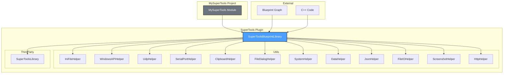

# SuperTools

**[English](README_EN.md) | [中文](README.md)**

A comprehensive utility framework plugin for Unreal Engine 5.7, providing commonly used functions for immersive content and interactive development.

**Author**: lostpanda

---

## Table of Contents

- [Overview](#overview)
- [Architecture](#architecture)
- [Features](#features)
  - [INI File Operations](#ini-file-operations)
  - [Windows API Wrappers](#windows-api-wrappers)
  - [UDP Communication](#udp-communication)
  - [Serial Port Communication](#serial-port-communication)
  - [Clipboard Operations](#clipboard-operations)
  - [File Dialog Operations](#file-dialog-operations)
  - [System Operations](#system-operations)
  - [Data Processing](#data-processing)
  - [JSON Operations](#json-operations)
  - [File I/O Operations](#file-io-operations)
  - [Screenshot Operations](#screenshot-operations)
  - [HTTP Operations](#http-operations)
- [Project Structure](#project-structure)
- [Requirements](#requirements)
- [Installation](#installation)
- [Usage](#usage)
- [Build Commands](#build-commands)
- [License](#license)

---

## Overview

SuperTools is a powerful utility plugin designed to simplify common immersive content and interactive development tasks in Unreal Engine 5.7. It provides a comprehensive set of Blueprint-callable functions covering file operations, network communication, system utilities, and more.

**Key Benefits:**
- All functions are Blueprint-friendly with intuitive interfaces
- Cross-platform support where applicable
- Easy to extend and customize
- Well-documented API with Chinese keyword support for search

---

## Architecture



**Architecture Overview:**

| Layer | Component | Description |
|-------|-----------|-------------|
| **API Layer** | `USuperToolsBlueprintLibrary` | Main entry point exposing all functions to Blueprint and C++ |
| **Utility Layer** | `Utils/*Helper` | Modular helper classes implementing specific functionality |
| **Integration Layer** | `ThirdParty/SuperToolsLibrary` | External library support with runtime DLL loading |
| **Consumer Layer** | Blueprint / C++ | Game code that uses the plugin functions |

---

## Features

### INI File Operations

Read and write configuration values from INI files with cross-platform support.

**Blueprint Category:** `SuperTools|INI`

| Function | Description | Parameters |
|----------|-------------|------------|
| `ReadIniString` | Read string value from INI file | `FilePath`, `Section`, `Key`, `DefaultValue` |
| `ReadIniInt` | Read integer value from INI file | `FilePath`, `Section`, `Key`, `DefaultValue` |
| `ReadIniFloat` | Read float value from INI file | `FilePath`, `Section`, `Key`, `DefaultValue` |
| `ReadIniBool` | Read boolean value from INI file | `FilePath`, `Section`, `Key`, `DefaultValue` |
| `WriteIniString` | Write string value to INI file | `FilePath`, `Section`, `Key`, `Value` |
| `WriteIniInt` | Write integer value to INI file | `FilePath`, `Section`, `Key`, `Value` |
| `WriteIniFloat` | Write float value to INI file | `FilePath`, `Section`, `Key`, `Value` |
| `WriteIniBool` | Write boolean value to INI file | `FilePath`, `Section`, `Key`, `Value` |

> **Note:** Windows uses native API (`GetPrivateProfileString`/`WritePrivateProfileString`), other platforms use manual parsing.

---

### Windows API Wrappers

Control application window properties and system settings.

**Blueprint Category:** `SuperTools|Windows`

| Function | Description | Return Type |
|----------|-------------|-------------|
| `SetWindowTitle` | Set the application window title | `bool` |
| `GetWindowTitle` | Get the current window title | `FString` |
| `GetScreenResolution` | Get screen width and height | `bool` (out: Width, Height) |
| `SetWindowPosition` | Set window position (X, Y) | `bool` |
| `SetWindowSize` | Set window dimensions (Width, Height) | `bool` |
| `MaximizeWindow` | Maximize the application window | `bool` |
| `MinimizeWindow` | Minimize the application window | `bool` |
| `RestoreWindow` | Restore window from minimized/maximized state | `bool` |
| `BringWindowToFront` | Bring window to foreground | `bool` |

> **Platform Note:** These functions only work on Windows. Other platforms return `false` or empty values.

---

### UDP Communication

Send and receive data over UDP protocol for network communication.

**Blueprint Category:** `SuperTools|UDP`

#### Send Functions

| Function | Description | Parameters |
|----------|-------------|------------|
| `UdpSendBytes` | Send byte array to IP:Port | `IP`, `Port`, `Data` |
| `UdpSendString` | Send string message to IP:Port | `IP`, `Port`, `Message` |

#### Simplified Receive Interface (Recommended)

| Function | Description | Parameters |
|----------|-------------|------------|
| `StartUdpReceive` | Start listening on port, returns handle | `Port` |
| `GetUdpMessage` | Get latest message (auto-clears buffer) | `Handle` → `OutMessage`, `OutSenderIP`, `OutSenderPort` |
| `GetAllUdpMessages` | Get all messages as string array | `Handle` |
| `StopUdpReceive` | Stop listening and release resources | `Handle` |

#### Advanced Receive Interface

| Function | Description | Parameters |
|----------|-------------|------------|
| `CreateUdpListener` | Create listener with custom buffer size | `Port`, `MaxBufferSize` |
| `DestroyUdpListener` | Destroy listener and release resources | `Handle` |
| `IsUdpListenerValid` | Check if listener handle is valid | `Handle` |
| `HasUdpData` | Check if data is available | `Handle` |
| `GetUdpPacketCount` | Get number of received packets | `Handle` |
| `GetAllUdpPackets` | Get all packets with sender info | `Handle` |
| `GetLatestUdpPacket` | Get most recent packet | `Handle` → `OutPacket` |
| `ClearUdpBuffer` | Clear receive buffer | `Handle` |
| `BytesToString` | Convert byte array to UTF-8 string | `Data` |

---

### Serial Port Communication

Full-featured serial port communication for hardware integration.

**Blueprint Category:** `SuperTools|SerialPort`

| Function | Description | Parameters |
|----------|-------------|------------|
| `OpenSerialPort` | Open port with default settings | `PortName`, `BaudRate` (default: 9600) |
| `OpenSerialPortWithConfig` | Open port with full configuration | `PortName`, `Config` (struct) |
| `CloseSerialPort` | Close serial port | `Handle` |
| `IsSerialPortOpen` | Check if port is open | `Handle` |
| `SerialWriteBytes` | Write byte array to port | `Handle`, `Data` |
| `SerialWriteString` | Write string to port | `Handle`, `Message` |
| `SerialReadBytes` | Read bytes from port | `Handle`, `MaxBytes` |
| `SerialReadString` | Read string from port | `Handle`, `MaxBytes` |
| `GetSerialBytesAvailable` | Get available bytes in buffer | `Handle` |
| `FlushSerialBuffers` | Clear input/output buffers | `Handle`, `bClearInput`, `bClearOutput` |
| `GetAvailableSerialPorts` | List all available COM ports | - |

**Serial Port Configuration (FSerialPortConfig):**
- `BaudRate`: Communication speed (9600, 115200, etc.)
- `DataBits`: Data bits per byte (7, 8)
- `Parity`: Parity checking (None, Odd, Even)
- `StopBits`: Stop bits (1, 1.5, 2)
- `FlowControl`: Flow control (None, Hardware, Software)

> **Platform Note:** Serial port functions are fully supported on Windows only.

---

### Clipboard Operations

Copy and paste text and images to/from system clipboard.

**Blueprint Category:** `SuperTools|Clipboard`

#### Text Operations

| Function | Description | Parameters |
|----------|-------------|------------|
| `CopyToClipboard` | Copy text to clipboard | `Text` |
| `GetFromClipboard` | Get text from clipboard | → `OutText` |
| `HasClipboardText` | Check if clipboard has text | - |
| `ClearClipboard` | Clear clipboard contents | - |

#### Image Operations (Windows Only)

| Function | Description | Parameters |
|----------|-------------|------------|
| `CopyImageToClipboard` | Copy image file to clipboard | `ImagePath` (PNG, BMP, JPG) |
| `GetImageFromClipboard` | Save clipboard image to file | `SavePath` |
| `HasClipboardImage` | Check if clipboard has image | - |

---

### File Dialog Operations

Native file and folder selection dialogs.

**Blueprint Category:** `SuperTools|FileDialog`

| Function | Description | Parameters |
|----------|-------------|------------|
| `OpenFileDialog` | Single file selection | `DialogTitle`, `DefaultPath`, `FileTypes` → `OutFilePath` |
| `OpenFileDialogMultiple` | Multiple file selection | `DialogTitle`, `DefaultPath`, `FileTypes` → `OutFilePaths` |
| `SaveFileDialog` | Save file dialog | `DialogTitle`, `DefaultPath`, `DefaultFileName`, `FileTypes` → `OutFilePath` |
| `OpenFolderDialog` | Folder selection | `DialogTitle`, `DefaultPath` → `OutFolderPath` |

**File Types Format Example:**
```
All Files (*.*)|*.*|Text Files (*.txt)|*.txt|Images (*.png;*.jpg)|*.png;*.jpg
```

---

### System Operations

System utilities and external application control.

**Blueprint Category:** `SuperTools|System`

| Function | Description | Parameters |
|----------|-------------|------------|
| `OpenURL` | Open URL in default browser | `URL` |
| `OpenFolderInExplorer` | Open folder in file explorer | `FolderPath` |
| `OpenFileWithDefaultApp` | Open file with default application | `FilePath` |
| `LaunchApplication` | Launch external application | `ExecutablePath`, `Arguments`, `bHidden` |
| `GetEnvVariable` | Get environment variable value | `VariableName` |
| `GetFormattedTime` | Get formatted current time | `Format` (default: `%Y-%m-%d %H:%M:%S`) |
| `GetComputerName` | Get computer/hostname | - |
| `GetCurrentUserName` | Get current user name | - |

**Time Format Specifiers:**
- `%Y` - Year (4 digits)
- `%m` - Month (01-12)
- `%d` - Day (01-31)
- `%H` - Hour (00-23)
- `%M` - Minute (00-59)
- `%S` - Second (00-59)

---

### Data Processing

Encoding, hashing, and data transformation utilities.

**Blueprint Category:** `SuperTools|Data`

#### Base64 Encoding

| Function | Description | Parameters |
|----------|-------------|------------|
| `Base64Encode` | Encode string to Base64 | `Input` |
| `Base64Decode` | Decode Base64 string | `Input` → `OutDecoded` |

#### Hash Functions

| Function | Description | Parameters |
|----------|-------------|------------|
| `MD5Hash` | Calculate MD5 hash of string | `Input` → 32-char hex string |
| `MD5HashFile` | Calculate MD5 hash of file | `FilePath` → `OutHash` |
| `SHA256Hash` | Calculate SHA256 hash of string | `Input` → 64-char hex string |
| `SHA256HashFile` | Calculate SHA256 hash of file | `FilePath` → `OutHash` |

> **Note:** SHA256 on Windows uses CryptoAPI for optimal performance.

---

### JSON Operations

Parse and create JSON data with support for nested paths.

**Blueprint Category:** `SuperTools|JSON`

#### Read Values

| Function | Description | Parameters |
|----------|-------------|------------|
| `JsonGetString` | Get string value from JSON | `JsonString`, `FieldName`, `DefaultValue` |
| `JsonGetInt` | Get integer value from JSON | `JsonString`, `FieldName`, `DefaultValue` |
| `JsonGetFloat` | Get float value from JSON | `JsonString`, `FieldName`, `DefaultValue` |
| `JsonGetBool` | Get boolean value from JSON | `JsonString`, `FieldName`, `DefaultValue` |
| `JsonGetStringArray` | Get string array from JSON | `JsonString`, `FieldName` → `OutArray` |

**Nested Path Support:**
```cpp
// Access nested values using dot notation
JsonGetString(JsonStr, "data.user.name", "Unknown")
JsonGetInt(JsonStr, "response.items.0.id", 0)
```

#### Create JSON

| Function | Description | Parameters |
|----------|-------------|------------|
| `MakeJsonString` | Create simple key-value JSON | `Key`, `Value` |
| `MapToJson` | Convert Map to JSON string | `StringMap`, `bPrettyPrint` |
| `JsonToMap` | Parse JSON to Map | `JsonString` → `OutMap` |

---

### File I/O Operations

Comprehensive file and directory manipulation.

**Blueprint Category:** `SuperTools|FileIO`

#### Text File Operations

| Function | Description | Parameters |
|----------|-------------|------------|
| `ReadTextFile` | Read entire text file | `FilePath` → `OutContent` |
| `WriteTextFile` | Write text to file | `FilePath`, `Content`, `bAppend` |
| `ReadFileLines` | Read file as line array | `FilePath` → `OutLines` |
| `WriteFileLines` | Write line array to file | `FilePath`, `Lines`, `bAppend` |

#### Binary File Operations

| Function | Description | Parameters |
|----------|-------------|------------|
| `ReadBinaryFile` | Read binary file | `FilePath` → `OutData` |
| `WriteBinaryFile` | Write binary file | `FilePath`, `Data` |

#### File/Directory Checks

| Function | Description | Parameters |
|----------|-------------|------------|
| `DoesFileExist` | Check if file exists | `FilePath` |
| `DoesDirectoryExist` | Check if directory exists | `DirectoryPath` |
| `GetFileSizeBytes` | Get file size in bytes | `FilePath` |

#### File/Directory Management

| Function | Description | Parameters |
|----------|-------------|------------|
| `CreateDirectoryPath` | Create directory (including parents) | `DirectoryPath` |
| `DeleteFileAtPath` | Delete a file | `FilePath` |
| `DeleteDirectoryAtPath` | Delete directory and contents | `DirectoryPath` |
| `CopyFileToPath` | Copy file | `SourcePath`, `DestPath`, `bOverwrite` |
| `MoveFileToPath` | Move/rename file | `SourcePath`, `DestPath` |

#### Directory Listing

| Function | Description | Parameters |
|----------|-------------|------------|
| `GetFilesInDir` | List files in directory | `DirectoryPath`, `Extension`, `bRecursive` → `OutFiles` |
| `GetDirectoriesInDir` | List subdirectories | `DirectoryPath`, `bRecursive` → `OutDirectories` |

#### Path Utilities

| Function | Description | Parameters |
|----------|-------------|------------|
| `GetFileExt` | Get file extension (without dot) | `FilePath` |
| `GetFileNameFromPath` | Get filename from path | `FilePath`, `bWithExtension` |
| `GetFileDir` | Get directory from file path | `FilePath` |

---

### Screenshot Operations

Capture game viewport and screen regions.

**Blueprint Category:** `SuperTools|Screenshot`

| Function | Description | Parameters |
|----------|-------------|------------|
| `CaptureViewportToFile` | Capture game viewport | `FilePath`, `bShowUI` |
| `RequestScreenshotToFile` | Async screenshot (engine system) | `FilePath`, `bShowUI` |
| `CaptureScreenToFile` | Capture entire screen (Windows) | `FilePath` |
| `CaptureRegionToFile` | Capture screen region (Windows) | `FilePath`, `X`, `Y`, `Width`, `Height` |

**Supported Formats:** PNG, BMP, JPG (determined by file extension)

> **Note:** `CaptureScreenToFile` and `CaptureRegionToFile` are Windows-only functions.

---

### HTTP Operations

Asynchronous HTTP requests using Latent Actions.

**Blueprint Category:** `SuperTools|HTTP`

| Function | Description | Parameters |
|----------|-------------|------------|
| `HttpGet` | Async HTTP GET request | `URL` → `OutResponse`, `OutResponseCode`, `bOutSuccess` |
| `HttpPost` | Async HTTP POST request | `URL`, `Content`, `ContentType` → `OutResponse`, `OutResponseCode`, `bOutSuccess` |
| `HttpDownloadFile` | Async file download | `URL`, `SavePath` → `OutResponseCode`, `bOutSuccess` |

> **Note:** These are latent actions that execute asynchronously in Blueprints. The execution flow continues after the request completes.

---

## Project Structure

```text
MySuperTools/
├── Source/MySuperTools/              # Main game module
│   ├── MySuperTools.h/cpp            # Module implementation
│   └── MySuperTools.Build.cs         # Build configuration
├── Plugins/SuperTools/               # Plugin module
│   └── Source/
│       ├── SuperTools/               # Core plugin code
│       │   ├── Public/
│       │   │   ├── SuperToolsBlueprintLibrary.h    # Main Blueprint API
│       │   │   └── Utils/                          # Utility classes
│       │   │       ├── IniFileHelper.h             # INI file operations
│       │   │       ├── WindowsAPIHelper.h          # Windows API wrappers
│       │   │       ├── UdpHelper.h                 # UDP communication
│       │   │       ├── SerialPortHelper.h          # Serial port communication
│       │   │       ├── ClipboardHelper.h           # Clipboard operations
│       │   │       ├── FileDialogHelper.h          # File dialogs
│       │   │       ├── SystemHelper.h              # System utilities
│       │   │       ├── DataHelper.h                # Data processing
│       │   │       ├── JsonHelper.h                # JSON operations
│       │   │       ├── FileIOHelper.h              # File I/O
│       │   │       ├── ScreenshotHelper.h          # Screenshot capture
│       │   │       ├── HttpHelper.h                # HTTP utilities
│       │   │       └── HttpLatentActions.h         # HTTP latent actions
│       │   └── Private/                            # Implementation files
│       └── ThirdParty/                             # Third-party library integration
│           └── SuperToolsLibrary/                  # External library support
├── Config/                           # Configuration files
│   ├── DefaultEngine.ini             # Engine configuration
│   ├── DefaultEditor.ini             # Editor preferences
│   ├── DefaultGame.ini               # Game settings
│   └── DefaultInput.ini              # Input bindings
└── Build.bat                         # Build script (Windows)
```

---

## Requirements

- **Engine:** Unreal Engine 5.7
- **IDE:**
  - Visual Studio 2022 (Windows)
  - Xcode (macOS)
  - GCC/Clang (Linux)
- **Platform:** Windows, macOS, Linux (some features are Windows-only)

---

## Installation

1. Clone the repository:

   ```bash
   git clone https://github.com/your-repo/SuperTools.git
   ```

2. Open `MySuperTools/MySuperTools.uproject` with Unreal Engine 5.7

3. Build the project (or let the editor compile on first launch)

4. Enable the SuperTools plugin if not already enabled (Edit → Plugins → SuperTools)

---

## Usage

### Blueprint

All functions are available in Blueprints under the `SuperTools` category. Use the search function with English or Chinese keywords.

**Blueprint Categories:**

| Category | Description |
|----------|-------------|
| `SuperTools\|INI` | INI file operations |
| `SuperTools\|Windows` | Windows API functions |
| `SuperTools\|UDP` | UDP communication |
| `SuperTools\|SerialPort` | Serial port communication |
| `SuperTools\|Clipboard` | Clipboard operations |
| `SuperTools\|FileDialog` | File dialog operations |
| `SuperTools\|System` | System operations |
| `SuperTools\|Data` | Data processing (Base64, MD5, SHA256) |
| `SuperTools\|JSON` | JSON operations |
| `SuperTools\|FileIO` | File I/O operations |
| `SuperTools\|Screenshot` | Screenshot operations |
| `SuperTools\|HTTP` | HTTP operations (async) |

### C++ Integration

Include the main header and call functions directly:

```cpp
#include "SuperToolsBlueprintLibrary.h"

// Read INI value
FString Value = USuperToolsBlueprintLibrary::ReadIniString(
    TEXT("C:/Config/settings.ini"),
    TEXT("General"),
    TEXT("PlayerName"),
    TEXT("DefaultPlayer")
);

// Set window title (Windows only)
USuperToolsBlueprintLibrary::SetWindowTitle(TEXT("My Game"));

// Read JSON value with nested path
FString Name = USuperToolsBlueprintLibrary::JsonGetString(
    JsonString,
    TEXT("data.user.name"),
    TEXT("Unknown")
);

// Send UDP message
USuperToolsBlueprintLibrary::UdpSendString(
    TEXT("192.168.1.100"),
    8080,
    TEXT("Hello from UE5!")
);

// File operations
FString Content;
if (USuperToolsBlueprintLibrary::ReadTextFile(TEXT("C:/data.txt"), Content))
{
    UE_LOG(LogTemp, Log, TEXT("File content: %s"), *Content);
}
```

---

## Build Commands

Use the provided `Build.bat` script for common build operations:

```bash
# Build Editor (Development)
Build.bat  # Select option 1

# Build Game (Shipping)
Build.bat  # Select option 2

# Build Game (Development)
Build.bat  # Select option 3

# Generate Project Files
Build.bat  # Select option 4

# Clean and Rebuild
Build.bat  # Select option 5
```

### Manual Build Commands

```bash
# Build Editor (Development)
"C:\Program Files\Epic Games\UE_5.7\Engine\Build\BatchFiles\Build.bat" MySuperToolsEditor Win64 Development -Project="MySuperTools.uproject"

# Package for Windows (Shipping)
"C:\Program Files\Epic Games\UE_5.7\Engine\Build\BatchFiles\RunUAT.bat" BuildCookRun -project="MySuperTools.uproject" -platform=Win64 -clientconfig=Shipping -cook -stage -pak -archive
```

---

## Platform Support

| Feature | Windows | macOS | Linux |
|---------|---------|-------|-------|
| INI File Operations | Native API | Untested | Untested |
| Window Management | Full | N/A | N/A |
| UDP Communication | Full | Untested | Untested |
| Serial Port | Full | N/A | N/A |
| Clipboard (Text) | Full | Untested | Untested |
| Clipboard (Image) | Full | N/A | N/A |
| File Dialogs | Full | Untested | Untested |
| System Operations | Full | Untested | Untested |
| Data Processing | Full | Untested | Untested |
| JSON Operations | Full | Untested | Untested |
| File I/O | Full | Untested | Untested |
| Screenshot (Viewport) | Full | Untested | Untested |
| Screenshot (Screen) | Full | N/A | N/A |
| HTTP Operations | Full | Untested | Untested |

> **Note:** macOS and Linux platforms have not been tested yet. "N/A" indicates features that are Windows-only by design.

---

## License

Copyright lostpanda. All Rights Reserved.
